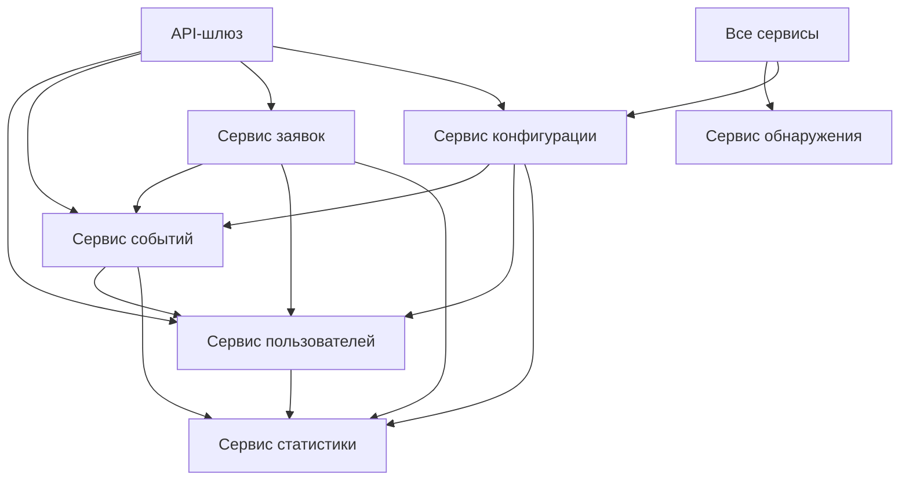

# Explore With Me

Explore With Me — это сервис для организации мероприятий и участия в них. Пользователи могут создавать события, находить интересные мероприятия, отправлять заявки на участие и комментировать события.

Проект реализован как монолитное приложение с модульной архитектурой, где каждый функциональный блок выделен в отдельный модуль с четкими границами ответственности.

## Архитектура проекта

### Основные сервисы

- **Сервис пользователей (user-service)**  
  - Регистрация и управление пользователями  
  - Получение информации о пользователях  

- **Сервис событий (event-service)**  
  - Управление событиями (создание, редактирование, поиск)  
  - Управление категориями событий  
  - Управление подборками событий  

- **Сервис заявок (request-service)**  
  - Обработка заявок на участие в событиях  
  - Подтверждение/отклонение заявок  

- **Сервис комментариев (comment-service)**  
  - Добавление комментариев к событиям  
  - Редактирование и удаление комментариев  

- **Сервис статистики (stats-server)**  
  - Сбор статистики просмотров событий  
  - Предоставление аналитики  

### Инфраструктурные сервисы

- **Сервис конфигурации (config-server)**  
  - Централизованное хранение конфигураций  
  - Динамическое обновление настроек  

- **Сервис обнаружения (discovery-server)**  
  - Регистрация и обнаружение сервисов (Eureka)  
  - Балансировка нагрузки  

- **API-шлюз (gateway-server)**  
  - Единая точка входа для всех запросов  
  - Маршрутизация запросов  
  - Логирование  

## Технологический стек

- **Язык**: Java 21  
- **Фреймворки**: Spring Boot, Spring Cloud, Spring Data JPA  
- **База данных**: PostgreSQL  
- **Сервис обнаружения**: Netflix Eureka  
- **API-шлюз**: Spring Cloud Gateway  
- **Клиент-серверное взаимодействие**: OpenFeign  
- **Валидация**: Hibernate Validator  
- **Маппинг**: MapStruct  
- **Логирование**: Lombok Slf4j  
- **Сборка**: Maven  
- **Контейнеризация**: Docker  

## Схема взаимодействия сервисов



## API-эндпоинты

### Основные эндпоинты

- **Пользователи**:  
  - `POST /admin/users` — Создание пользователя  
  - `GET /admin/users` — Получение списка пользователей  
  - `DELETE /admin/users/{id}` — Удаление пользователя  

- **События**:  
  - **Публичные**:  
    - `GET /events` — Получение списка событий  
    - `GET /events/{id}` — Получение события по ID  
  - **Приватные**:  
    - `POST /users/{userId}/events` — Создание события  
    - `PATCH /users/{userId}/events/{eventId}` — Обновление события  
  - **Админские**:  
    - `GET /admin/events` — Получение списка событий для администратора  
    - `PATCH /admin/events/{eventId}` — Обновление события администратором  

- **Заявки**:  
  - `POST /users/{userId}/requests` — Создание заявки на участие  
  - `GET /users/{userId}/requests` — Получение списка заявок  

- **Комментарии**:  
  - `POST /events/{eventId}/comments` — Добавление комментария к событию  
  - `GET /events/{eventId}/comments` — Получение списка комментариев  

Полная спецификация API доступна в файле `ewm-main-service-spec.json`.

## Запуск проекта

### Требования

- Java 21  
- Maven 3.8+  
- Docker 20.10+  
- PostgreSQL 14+  

### Инструкция по запуску

1. **Настройка баз данных**  
   Создайте необходимые базы данных:

   ```bash
   createdb userDb
   createdb eventDb
   createdb requestDb
   createdb commentDb
   createdb statsDb
   ```

2. **Запуск инфраструктурных сервисов**  
   - **Сервис обнаружения**:

     ```bash
     cd infra/discovery-server
     mvn spring-boot:run
     ```

   - **Сервис конфигурации** (в отдельном терминале):

     ```bash
     cd infra/config-server
     mvn spring-boot:run
     ```

3. **Запуск основных сервисов**  
   - **Сервис пользователей**:

     ```bash
     cd core/user-service
     mvn spring-boot:run
     ```

   - **Сервис событий**:

     ```bash
     cd core/event-service
     mvn spring-boot:run
     ```

   - **Сервис заявок**:

     ```bash
     cd core/request-service
     mvn spring-boot:run
     ```

   - **Сервис комментариев**:

     ```bash
     cd core/comment-service
     mvn spring-boot:run
     ```

   - **Сервис статистики**:

     ```bash
     cd stats/stats-server
     mvn spring-boot:run
     ```

   - **API-шлюз**:

     ```bash
     cd infra/gateway-server
     mvn spring-boot:run
     ```

4. **Запуск через Docker**  
   - Сборка образов:

     ```bash
     mvn clean package
     docker-compose build
     ```

   - Запуск приложения:

     ```bash
     docker-compose up
     ```

### Конфигурация

Основные настройки можно изменить в следующих файлах:  
- **Порт сервиса**: `server.port` в `application.yml` каждого сервиса  
- **Настройки базы данных**: `spring.datasource` в конфигурациях Config Server  
- **Маршрутизация шлюза**: `spring.cloud.gateway.routes` в `gateway-server.yml`  

## Примеры запросов

### Создание пользователя

```bash
curl -X POST 'http://localhost:8080/admin/users' \
-H 'Content-Type: application/json' \
-d '{
  "name": "Иван Иванов",
  "email": "ivan.ivanov@example.com"
}'
```

### Создание события

```bash
curl -X POST 'http://localhost:8080/users/1/events' \
-H 'Content-Type: application/json' \
-d '{
  "annotation": "Интересное событие",
  "category": 1,
  "description": "Подробное описание",
  "eventDate": "2025-12-31 15:00:00",
  "location": {
    "lat": 55.7558,
    "lon": 37.6176
  },
  "paid": true,
  "participantLimit": 100,
  "requestModeration": true,
  "title": "Новогодняя вечеринка"
}'
```

## Логирование

Все сервисы настроены на логирование ключевых операций. Уровень логирования можно настроить в:

```yaml
logging:
  level:
    root: INFO
    org.springframework.web: DEBUG
    ewm: DEBUG
```

## Мониторинг

Для мониторинга состояния сервисов используйте:  
- **Панель Eureka**: `http://localhost:8761`  
- **Эндпоинты Actuator**: `http://localhost:{port}/actuator`